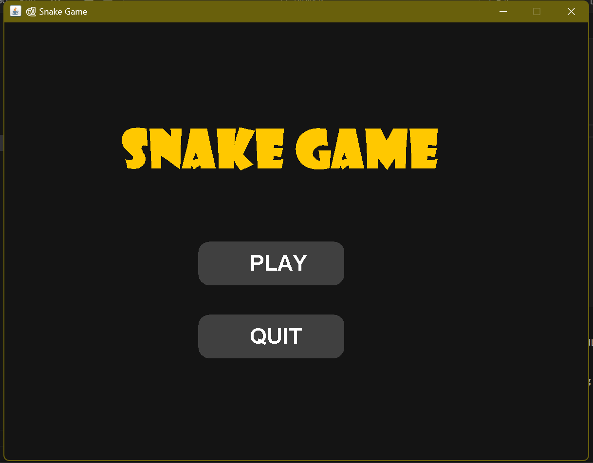
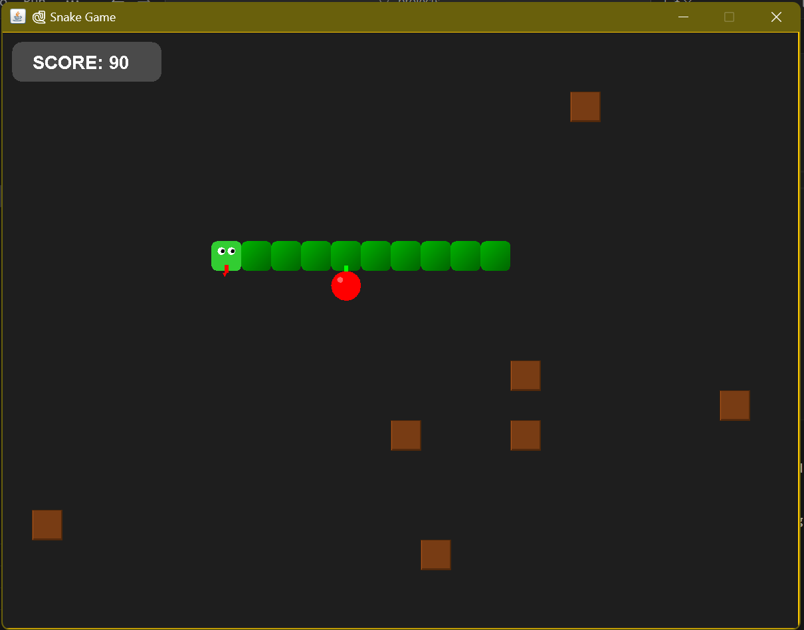
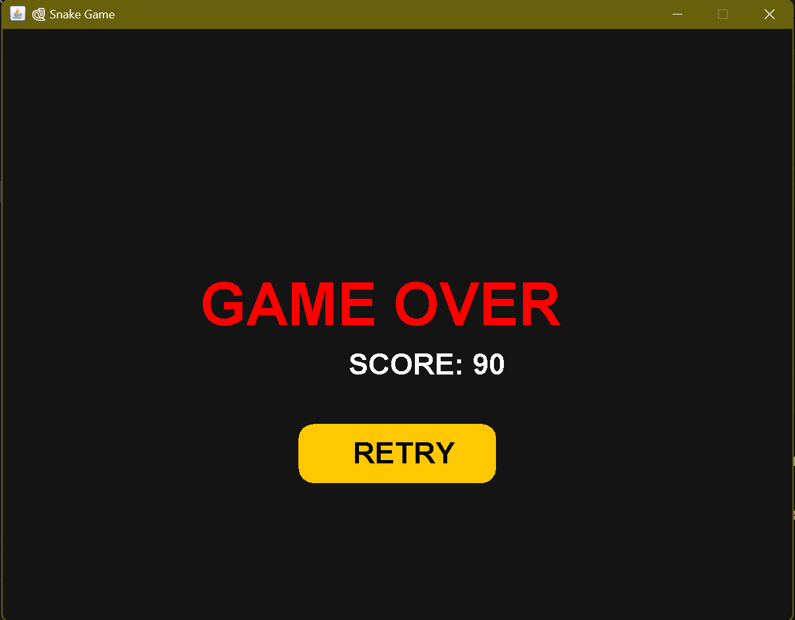

🐍 Java Snake Game

A classic Snake Game built completely in Java using Swing and AWT.
This project demonstrates smooth GUI rendering, real-time game logic, and responsive controls — all in a single, easy-to-run file.

The game includes a start menu, scoreboard, sprint mode, random obstacle generation, and retry option, giving it a polished and fun feel similar to retro arcade games.

🎮 Features

✅ Start Menu – Choose between Play or Quit
✅ Smooth Gameplay – Fluid snake movement with keyboard controls
✅ Dynamic Obstacles – Random obstacles appear as your score increases
✅ Scoreboard – Real-time score display on the top corner
✅ Retry Option – Instantly restart after game over
✅ Bigger Snake & Food – Visually clear and easy to play
✅ Single File Game – Everything inside one Java file for simplicity

🧠 Controls
Key	Action
⬆️	Move Up

⬇️	Move Down

⬅️	Move Left

➡️	Move Right

🖼️ Game Preview

⚙️ How to Run-:

Make sure you have Java JDK 8+ installed.
Then open your terminal or command prompt inside the project folder and run:

javac SnakeGame.java
java SnakeGame

The game window will open with a Play and Quit menu.
Click Play to start and use the arrow keys to control your snake!

💡 Concepts Used-:

This project demonstrates:-

-Java Swing GUI Design

-Event Handling with KeyListener & MouseAdapter

-Timer-based Game Loop using javax.swing.Timer

-Collision Detection (snake, wall, food, obstacles)

-Dynamic Object Rendering with Graphics2D

-Basic Game State Management (menu, game, game over)

🧰 Tech Stack

Language: Java

GUI Toolkit: Swing + AWT

IDE (optional): IntelliJ IDEA / Eclipse / VS Code

🏗️ Possible Future Improvements

Add background music or sound effects 🎵

Add difficulty levels (Easy, Medium, Hard)

Save high scores locally

Add special food for bonus points

Mobile-friendly version using JavaFX

🧑‍💻 Author

Kartik
🎓 Passionate about Java development, GUI programming, and creative projects.
If you like this project, feel free to ⭐ star the repository and share it!
